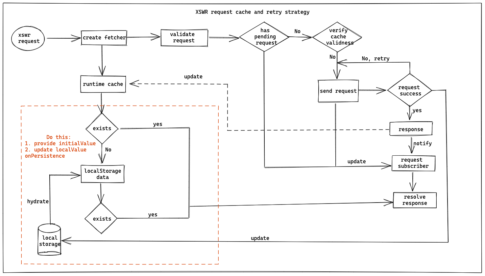

English | [简体中文](./README-zh_CN.md)

# xswr

_A data fetching solution for React Hooks and Imperative Ajax request_

[](https://www.npmjs.com/package/xswr) [](http://www.npmtrends.com/xswr) [](https://github.com/prettier/prettier)

## Introduction

xswr is inspired by [swr](https://github.com/zeit/swr) and documentation [HTTP RFC 5861](https://tools.ietf.org/html/rfc5861) mentioned in its readme file. In general, comparing with `swr`, `xswr` has following features

1. **Scenario**, applicable for React Hooks and Promise-base Ajax request
2. **Isolated Configuration Context**, fetcher is identified by `key` param and shared by items with same key, config is isolated from each other.
3. **Re-render control**, In React Hooks, it is configurable to control whether re-render component or not caused by data change.
4. **Easy to use**, In Promise-based Ajax chain request, retry and pooling could be performed automatically.

## Installation

With `npm`

```bash
npm install xswr
```

With `yarn`

```bash
yarn add xswr
```

## How does xswr works



## Usage

1. [useXS - React Hooks solution](./docs/useXS.md)
2. [xs - Promise-based Ajax solution](./docs/xs.md)
